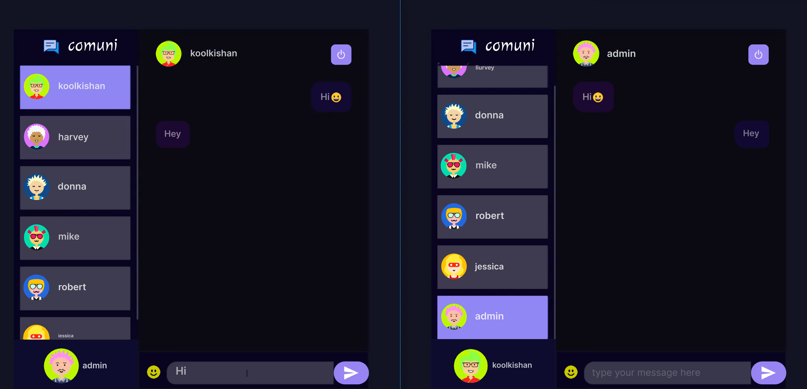
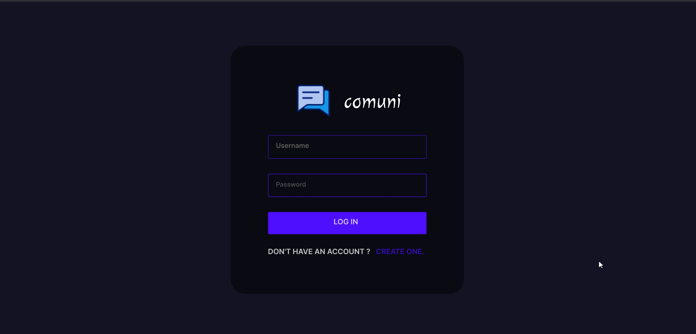

# Communication Platform (WhatsApp-like)

This project is a real-time communication platform similar to WhatsApp. It allows users to chat and communicate with others in real-time. The application uses **Socket.IO** for real-time messaging and **Node.js** with **MongoDB** for the backend.

## Key Features

- Real-time communication with other users
- User-friendly chat interface
- Built with **Socket.IO**, **Node.js**, and **MongoDB**
- Responsive design for optimal user experience

## Screenshots

### 1. Conversation Interface


### 2. Login Page


## Technologies Used

### Frontend
- **React JS**: JavaScript library for building user interfaces
- **Socket.IO**: For real-time, bidirectional communication between the browser and server

### Backend
- **Node JS**: JavaScript runtime for the backend
- **Express JS**: Web framework for Node.js
- **MongoDB**: Database for storing user and message data
- **Socket.IO**: Real-time communication

### Database
- **MongoDB**: Stores user information and chat messages

## Installation

1. Clone the repository:
   ```bash
   git clone https://github.com/maruf119459/comuni-chating-site.git

